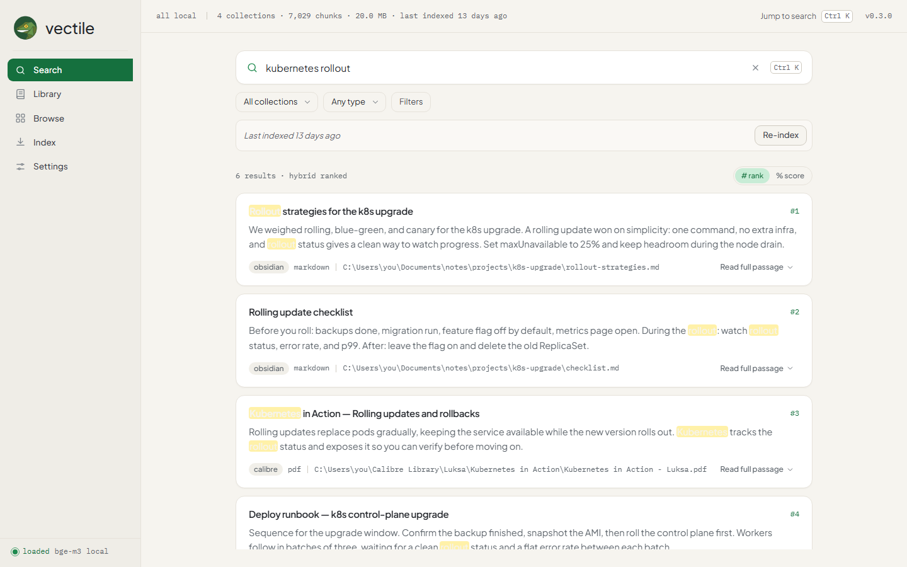
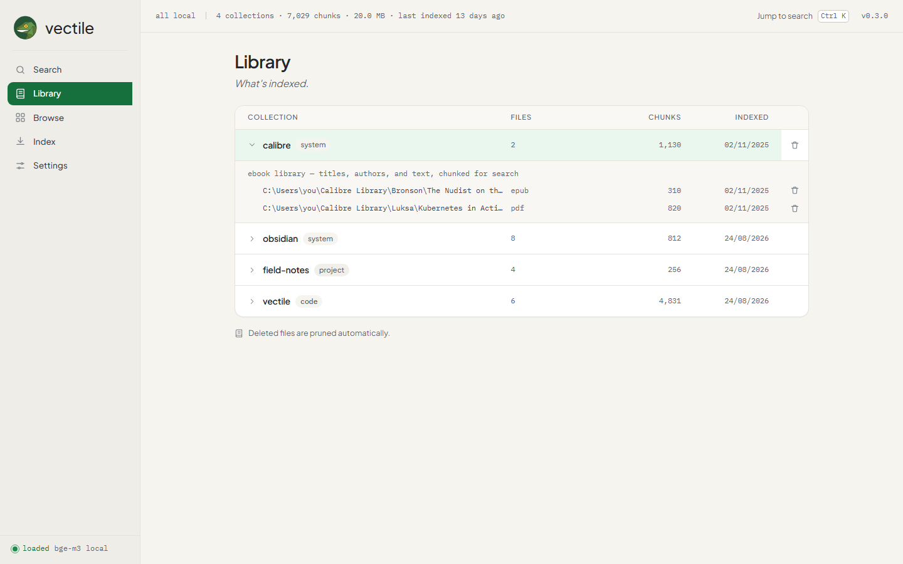
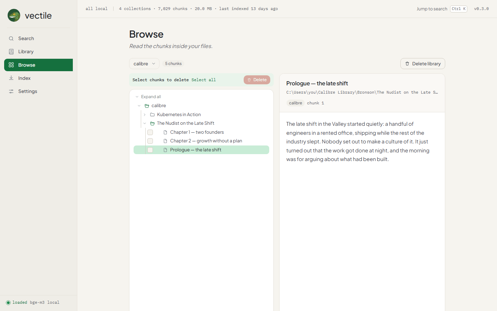
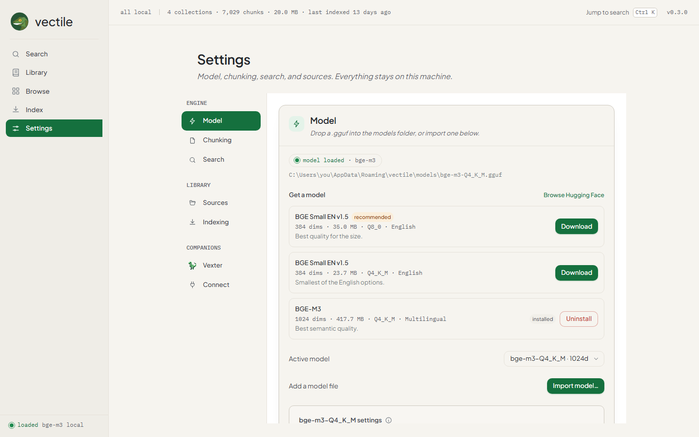
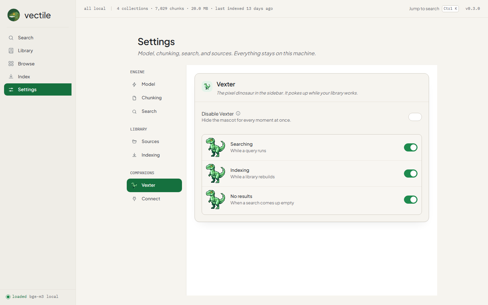

# vectile: your private library

A fully local, privacy-preserving RAG (Retrieval Augmented Generation) system for Windows, macOS, and Linux. It indexes personal knowledge from several sources into a single SQLite database with hybrid vector + full-text search, then lets you find things by meaning, not just by exact words, from a fast keyboard-first desktop app. Everything runs on your machine. No server, no cloud, no network calls.

Inspired by Sebastian Hutter’s local-rag. No Ollama, no API keys. The embedding model runs in-process from a `.gguf` file: import one of your own, or download one from the built-in catalog. Either way, nothing leaves your machine.

<p align="center">
  
</p>

## Features

- **Fully local and private.** Searches run on your machine against an in-process embedding model. No server, no cloud, no telemetry, no account.
- **Hybrid search.** Vector and full-text results are fused with Reciprocal Rank Fusion, so a query can find a note that never uses your exact words.
- **Index what you keep.** Obsidian vaults, project folders of documents (Markdown, PDF, DOCX, HTML, TXT, CSV, JSON, YAML, EPUB), Calibre libraries, and code repositories including their commit history.
- **Built-in model manager.** Import your own `.gguf`, pick the active model, or download one from the curated catalog in Settings with a live progress bar.
- **Keyboard-first desktop UI.** Jump to search from anywhere with ⌘K / Ctrl K, and move between Search, Library, Browse, Index, and Settings from the sidebar.
- **Manage your library.** Expand a collection to its files, drill into individual chunks, and delete stale sources, selected chunks, or a whole library in place.
- **AI assistant access (MCP).** Serve search and collection tools to Claude Desktop or any MCP client over a local server, with index and prune tools available behind an Allow write tools toggle.
- **A little company.** Vexter, the pixel dinosaur, pokes up in the sidebar while you search, index, or come up empty. Settings → Vexter controls each moment.

## Download


**Click your platform to download the latest version:**

[](https://github.com/d3uceY/vectile/releases/latest/download/vectile-windows-amd64-installer.exe) - ⚠️ SmartScreen will block it · [how to fix](#first-run-notes)<br>
[](https://github.com/d3uceY/vectile/releases/latest/download/vectile-windows-amd64.exe)<br>
[](https://github.com/d3uceY/vectile/releases/latest/download/vectile-linux-amd64.AppImage)<br>
[](https://github.com/d3uceY/vectile/releases/latest/download/vectile-linux-amd64.deb)<br>
[](https://github.com/d3uceY/vectile/releases/latest/download/vectile-macos-universal.dmg)

> Windows 10/11 · Linux (AppImage + deb) · macOS (universal arm64 + amd64) · **app is not code-signed, [see first-run notes below](#first-run-notes)**

### First-Run Notes

vectile is not code-signed, so your OS may warn you on first launch. The app is safe and fully open source — you can read every line of code here.

**Windows - SmartScreen**

1. Click **More info**
2. Click **Run anyway**

Or right-click the `.exe` -> **Properties** -> check **Unblock** -> **Apply**.

**macOS - Gatekeeper**

Right-click the app -> **Open** (once), or run `xattr -d com.apple.quarantine /path/to/vectile.app`.

**Linux**

The `.deb` pulls GTK4/WebKitGTK 6.0 + `libgomp1` automatically; the AppImage needs `chmod +x` before running.

## Screenshots

Screenshots show sample data.

<p align="center">
  
</p>

<table>
  <tr>
    <td></td>
    <td></td>
    <td></td>
  </tr>
</table>

<p align="center">
  
</p>

## Supported sources

| Source | Collection Type | What Gets Indexed |
|---|---|---|
| Obsidian | system | Vault files: `.md` notes with frontmatter, tags, and wikilinks |
| Project folders | project | Any folder of documents, each file parsed by its extension (`.md`, `.pdf`, `.docx`, `.html`, `.txt`, `.csv`, `.json`, `.yaml`, `.epub`) |
| Code repositories | code | Git repos: tree-sitter splits each function and class into its own chunk (cAST split-then-merge); commit history is indexed as its own source |
| Calibre | system | Ebook metadata + content: title, author, tags, series, publisher, description, and EPUB/PDF text |

## Installation

### From source

Prerequisites:

- Go 1.26+
- Node.js + npm
- the `wails3` CLI
- Windows only: MinGW-w64 on `PATH`, with `LIBRARY_PATH` and `C_INCLUDE_PATH` pointing at `third_party/llama-go` (the Windows build task sets these)

From the project root:

```
task dev          # run in development mode
task build        # build the binary to bin/
task package      # package an installer for the current OS
```

### Installing the model

Drop a `.gguf` file into the `models/` folder inside the app data directory, import one from Settings (a native file dialog copies it into `models/`), or grab one from the curated catalog right in the app — Settings → Model → **Get a model** downloads an embedding model with a click, with a live progress bar. The default model is bge-m3.

## Quick start

On a fresh install, a short tour walks you through it: add a folder, index it, then search.

1. Launch vectile.
2. Download or import an embedding model in Settings, or drop a `.gguf` into `models/`.
3. Add sources in Settings: Obsidian vaults, project folders, code repositories, Calibre libraries.
4. Open the Index view and index a collection, or everything at once. Unchanged files are skipped, so re-indexing is fast.
5. Press ⌘K / Ctrl K and search.

## GUI

Five views, keyboard-first:

- **Search** (home): a large search bar, a filter row, and results as cards with title, snippet, rank, collection, and source path. Expand a card to read the whole passage, open the file, or reveal it in the file manager. A small toggle switches each result between its rank (#1) and the blended score (%). Jump in from anywhere with ⌘K / Ctrl K.
- **Library**: every collection with its file and chunk counts and the last time it was indexed; expand one to list its files, and remove a source or its documents in place.
- **Browse**: a file tree of collections, files, and chunks, with a preview pane. Select chunks to delete them, or remove a whole library.
- **Index**: run "Index new" (only changed files) or "Re-index all" (re-embed everything) per collection, or index all collections at once, with live progress.
- **Settings**: sources, model (download an embedding model from the curated catalog, or import your own), chunking, search defaults, auto-reindex, start-on-login, Vexter (the sidebar mascot), and a Connect section that runs a local MCP server for AI assistants.

The sidebar shows the model state: idle, loaded, or failed. If the model file is missing or corrupt, vector search falls back to full-text search, so exact-word matches still work.

A little pixel dinosaur called **Vexter** lives in the sidebar and pokes up while your library works — while a query runs, while it indexes, and when a search comes up empty. It's purely decorative, and Settings → Vexter lets you turn each of those moments on or off independently.

Files you delete get pruned automatically, so results don't go stale. Auto-reindex, if enabled, re-indexes everything on a timer. Start-on-login launches the app with your session. The status strip shows when the library was last indexed; when auto-reindex is off and that date is more than a day old, Search quietly suggests a re-index.

### AI assistants (MCP)

Settings → Connect runs a local MCP (Model Context Protocol) server on `127.0.0.1:31123`. It exposes search and collection tools, plus index and prune tools that stay off until you enable **Allow write tools** in Settings. The server binds to loopback only, so nothing leaves the machine.

Point Claude Desktop, Claude Code, or any MCP client at `http://127.0.0.1:31123/sse` to search your library from the assistant. The Settings section shows the live server status, the tools it serves, and per-client setup directions.

## How search works

A query runs two searches at once.

- Full-text search matches the exact words against an FTS5 index. Fast, precise, literal.
- Vector search embeds the query and finds stored vectors that point the same way. That's how a query like "how do we ship changes safely" can match a note about blue-green deploys that never uses those words.

The vector path is two-stage: a cheap binary-quantized index finds a pool of candidates, then the exact float vectors are fetched and reranked by distance. The two result lists are merged with Reciprocal Rank Fusion, which blends ranks rather than scores.

Filters narrow results: collection, source type, path substring, sender or author, and date range. Top-k controls how many results come back.

## Configuration

Config file: `<os.UserConfigDir()>/vectile/config.json`

| Key | Default | Description |
|---|---|---|
| embedding_model | bge-m3 | Embedding model name |
| active_model | (default model path) | Path to the active `.gguf` model |
| embedding_batch_size | 32 | Chunks per embedding call |
| chunk_size_tokens | 500 | Chunk size in whitespace-separated words |
| chunk_overlap_tokens | 50 | Overlap between chunks |
| obsidian_vaults | [] | Paths to Obsidian vaults |
| obsidian_exclude_folders | [] | Folders to skip in vaults |
| calibre_libraries | [] | Paths to Calibre libraries |
| repositories | {} | Map of collection name to repo or directory paths; directories are scanned recursively for git repos |
| projects | {} | Map of collection name to document paths |
| disabled_collections | [] | Collection names to skip during indexing |
| skip_cloud_placeholders | true | Skip cloud-only placeholder files (OneDrive, iCloud, Google, Synology) instead of downloading them |
| git_history_in_months | 6 | How far back to index commit history |
| git_commit_subject_blacklist | [] | Skip commits whose subject starts with any of these strings |
| search_defaults.top_k | 10 | Default number of search results |
| search_defaults.rrf_k | 60 | Reciprocal Rank Fusion parameter |
| search_defaults.vector_weight | 0.7 | Weight for vector similarity |
| search_defaults.fts_weight | 0.3 | Weight for full-text search |
| gui.auto_reindex | false | Enable periodic re-indexing |
| gui.auto_reindex_interval_minutes | 60 | Minutes between auto-reindex runs |
| gui.start_on_login | false | Launch at login |
| gui.mascot.show_searching | true | Show Vexter in the sidebar while a query runs |
| gui.mascot.show_indexing | true | Show Vexter while a library rebuilds |
| gui.mascot.show_nothing | true | Show Vexter when a search comes up empty |
| mcp.enabled | false | Serve MCP tools to local AI assistants on launch |
| mcp.port | 31123 | Port the MCP server listens on (127.0.0.1 only) |
| mcp.allow_write | false | Let AI assistants call the index and prune tools |

## Tech stack

| Component | Choice | Notes |
|---|---|---|
| Language | Go 1.26+ | Wails v3 desktop app |
| UI | SolidJS + TypeScript + Vite | Tailwind CSS v4 |
| Database | SQLite (modernc.org/sqlite) + sqlite-vec + FTS5 | Pure Go, no cgo; single file |
| Embeddings | llama.go (llama.cpp) | In-process `.gguf`; bge-m3 by default; no Ollama |
| Code parsing | go-tree-sitter | Structural splitting (functions, classes, methods) with the cAST split-then-merge strategy |
| PDF | go-pdfium (WASM/Wazero) | No cgo needed |
| DOCX | archive/zip + encoding/xml | Word document extraction (.docx, .dotx) |

## Building and developing

```
task dev        # run in development mode
task build      # build the binary to bin/
task package    # package an installer for the current OS
```

Tests: `go test ./backend/...`. Model-dependent tests skip when the model is not in `models/`.

vectile links llama.cpp in-process through the vendored `third_party/llama-go`, whose static archives
are committed per-OS/per-arch under `third_party/llama-go/{windows,linux,darwin}/<arch>`. A build only
needs a C/C++ compiler on `PATH`; see [`docs/BUILD-AND-PACKAGING.md`](docs/BUILD-AND-PACKAGING.md) for
the full cross-platform build, packaging and release notes.

- **Windows (amd64):** needs MinGW-w64 on `PATH`, with `LIBRARY_PATH`/`C_INCLUDE_PATH` pointing at
  `third_party/llama-go` (the Windows build task sets these). The built exe needs five MinGW runtime
  DLLs beside it (`libgcc_s_seh-1.dll`, `libgomp-1.dll`, `libstdc++-6.dll`, `libwinpthread-1.dll`,
  `libdl.dll`). Missing `libdl.dll` causes a silent `0xC0000135` exit at launch.
- **Linux (amd64):** needs `gcc`/`g++`, `pkg-config`, `libgtk-4-dev`, `libwebkitgtk-6.0-dev` and
  `libayatana-appindicator3-dev`. The binary depends on `libgomp.so.1` at runtime (bundled in the
  AppImage, `Depends: libgomp1` in the `.deb`). `task linux:package` yields AppImage + `.deb`
  (+ `.rpm`/AUR).
- **macOS (universal):** needs Xcode Command Line Tools. `task darwin:build:universal` builds
  arm64 + amd64 and `lipo`s them together; `task darwin:package:dmg` wraps the `.app` in a DMG. The
  Metal/Accelerate frameworks are OS-provided, so nothing extra ships.

## Architecture

```
main.go                     app startup, window, services, auto-reindex loop
backend/appdata             the data directory and the model path
backend/config              config.json load, save, defaults
backend/db                  SQLite schema and helpers (modernc + vec0 + FTS5)
backend/embeddings          the llama.go embedder (bge-m3)
backend/chunker             word-window and markdown chunking
backend/parser              file parsers: md, docx, html, epub, pdf, calibre, code
backend/search              hybrid search: vector + FTS + RRF
backend/indexer             obsidian, project, git, calibre indexers; prune
backend/services            Wails services the UI calls
backend/startup             launch-at-login per OS
third_party/llama-go        vendored llama.cpp bindings
frontend/src/lib/api.ts     the only place the UI touches the bindings
```

## License

MIT License, copyright (c) 2026 d3uceY.
