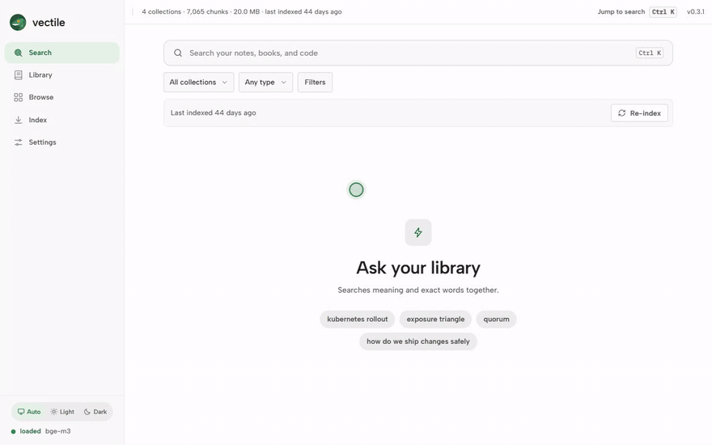
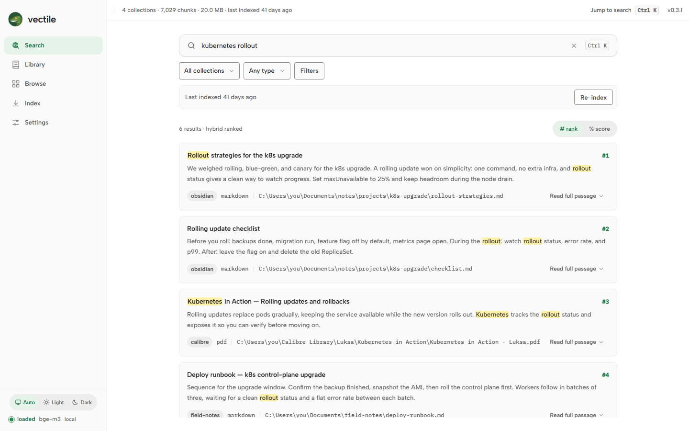
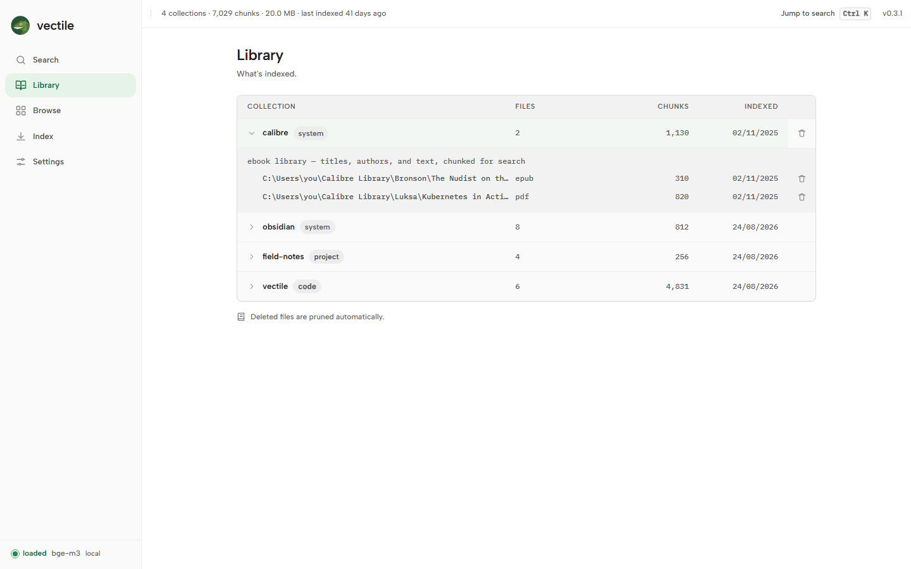
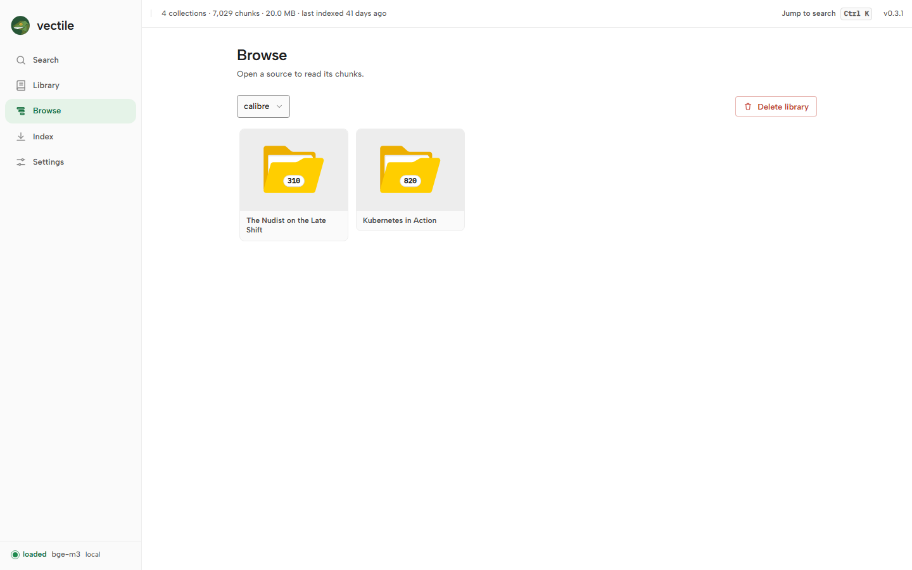
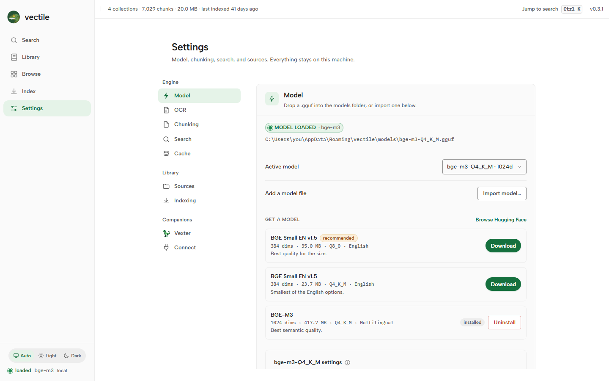
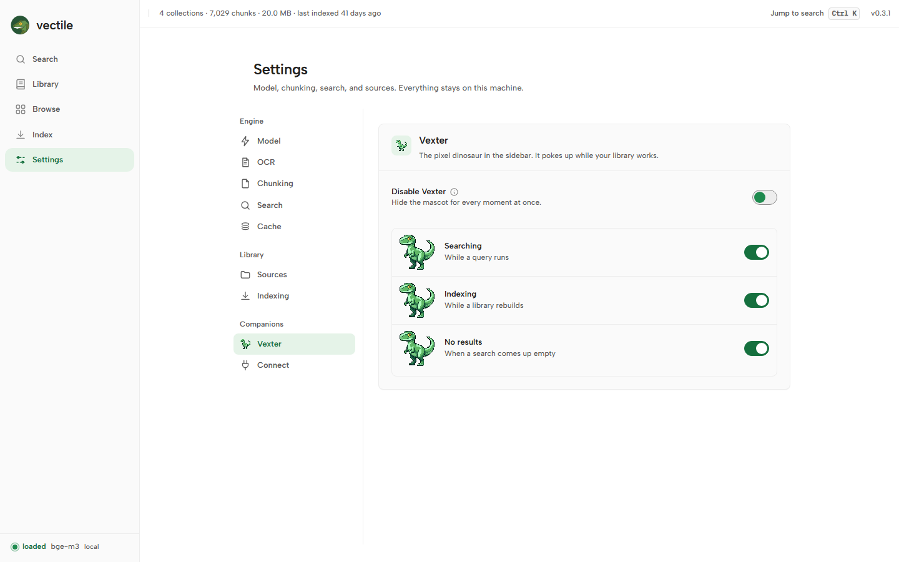
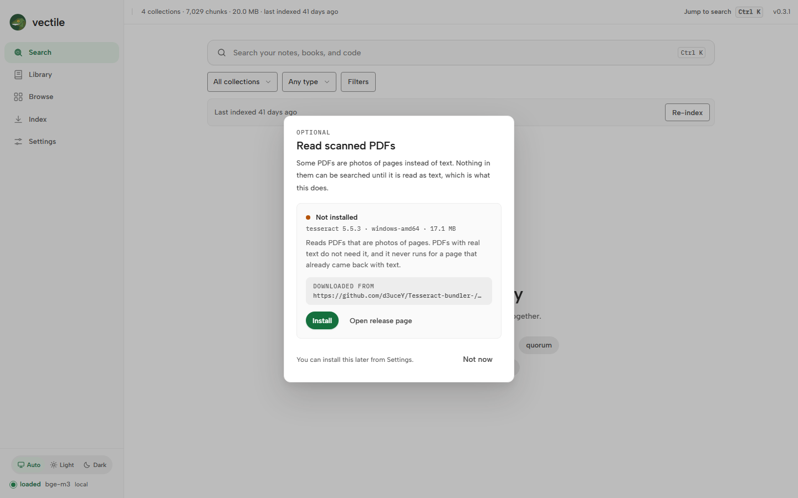
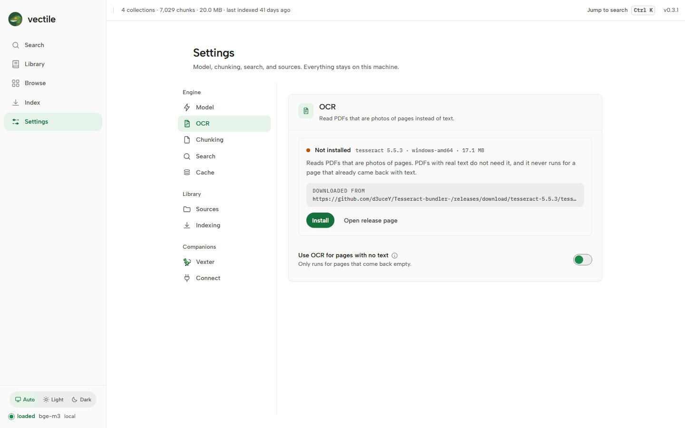

# vectile: your private library

A fully local, privacy-preserving RAG (Retrieval Augmented Generation) system for Windows, macOS, and Linux. It indexes personal knowledge from several sources into a single SQLite database with hybrid vector + full-text search and Reciprocal Rank fusion, then lets you find things by meaning, not just by exact words, from a fast keyboard-first desktop app. Everything runs on your machine.

Inspired by Sebastian Hutter’s local-rag. No Ollama, no API keys. The embedding model runs in-process from a `.gguf` file: import one of your own, or download one from the built-in catalog.

<p align="center">
  
</p>
<p align="center">
  
</p>

## Features

- **Private by default:** searches run on your own machine against a model loaded inside the app.
- **Search by meaning:** two searches run at once and their results are combined, so a note about blue-green deploys can match the query "how do we ship changes safely" even though it never uses those words.
- **Index what you already have:** Obsidian vaults, folders of documents (Markdown, PDF, DOCX, HTML, TXT, CSV, JSON, YAML, XML, SQL, shell scripts, XLSX, PPTX, Jupyter notebooks, EPUB), Calibre libraries, and code repositories, including their commit history.
- **Bring your own model:** import a `.gguf` file, choose which model is active, or download one from the list built into Settings.
- **Read scanned PDFs (optional):** one click in Settings installs a Tesseract OCR plugin, and PDFs that are photos of pages become searchable text.
- **Manage your library:** open a collection to see its files, page through individual chunks, and delete old sources, selected chunks, or a whole library in place.
- **Reach it from an AI assistant (MCP):** hand search, reading, and collection tools to Claude Desktop or any MCP client through a local server.

## Download


Pick your platform to download the latest version:

[](https://github.com/d3uceY/vectile/releases/latest/download/vectile-windows-amd64-installer.exe) - ⚠️ SmartScreen will block it · [how to fix](#first-run-notes)<br>
[](https://github.com/d3uceY/vectile/releases/latest/download/vectile-windows-amd64-portable.zip)<br>
[](https://github.com/d3uceY/vectile/releases/latest/download/vectile-linux-amd64.AppImage)<br>
[](https://github.com/d3uceY/vectile/releases/latest/download/vectile-linux-amd64.deb)<br>
[](https://github.com/d3uceY/vectile/releases/latest/download/vectile-macos-universal.dmg)

> Windows 10/11 · Linux (AppImage + deb) · macOS (universal arm64 + amd64) · **app is not code-signed, [see first-run notes below](#first-run-notes)**

On a Windows PC built before about 2013, the normal builds will not start: they need a CPU feature
called AVX2 that older processors do not have. Use the
[legacy installer](https://github.com/d3uceY/vectile/releases/latest/download/vectile-windows-amd64-legacy-installer.exe)
(or the [legacy portable zip](https://github.com/d3uceY/vectile/releases/latest/download/vectile-windows-amd64-legacy.zip)),
and pick the **BGE Small EN v1.5 Q8_0** model in Settings. The smaller quantized models are much slower
without AVX2.

### First-Run Notes

vectile is not code-signed, so your OS may warn you the first time you open it. The app is safe and open source, and you can read every line of the code.

**Windows - SmartScreen**

1. Click **More info**
2. Click **Run anyway**

Or right-click the `.exe` -> **Properties** -> check **Unblock** -> **Apply**.

**macOS - Gatekeeper**

Right-click the app -> **Open** (once), or run `xattr -d com.apple.quarantine /path/to/vectile.app`.

**Linux**

The `.deb` installs the system libraries it needs (GTK4, WebKitGTK 6.0, and `libgomp1`) for you. The AppImage needs `chmod +x` before it will run.

## Screenshots

<p align="center">
  
</p>

<table>
  <tr>
    <td></td>
    <td></td>
    <td></td>
  </tr>
</table>

<p align="center">
  
</p>

<table>
  <tr>
    <td></td>
    <td></td>
  </tr>
</table>

## Supported sources

| Source | Collection Type | What Gets Indexed |
|---|---|---|
| Obsidian | system | Vault files: `.md` notes with frontmatter, tags, and wikilinks |
| Project folders | project | Any folder of documents, each file parsed by its extension (`.md`, `.pdf`, `.docx`, `.html`, `.txt`, `.csv`, `.json`, `.yaml`, `.xml`, `.sql`, `.sh`, `.xlsx`, `.pptx`, `.ipynb`, `.epub`) |
| Code repositories | code | Git repos: tree-sitter splits each function and class into its own chunk (cAST split-then-merge); commit history is indexed as its own source |
| Calibre | system | Ebook metadata + content: title, author, tags, series, publisher, description, and EPUB/PDF text |

If a PDF is photos of pages instead of text, turn on the optional OCR plugin in Settings → OCR. When a run finds a page it cannot read, it tells you.

## Installation

### From source

To build vectile yourself, install:

- Go 1.26 or newer
- Node.js with npm
- the `wails3` command-line tool (the desktop framework vectile is built on)
- on Windows only: MinGW-w64 on your `PATH`, with `LIBRARY_PATH` and `C_INCLUDE_PATH` pointing at `third_party/llama-go` (the Windows build task sets these for you)

Then, from the project root:

```
task dev          # run in development mode
task build        # build the binary to bin/
task package      # package an installer for the current OS
```

### Installing the model

The embedding model is a `.gguf` file, and there are three ways to add one: import a file you already have from Settings (a file picker copies it into the `models/` folder), drop a `.gguf` into that `models/` folder yourself, or open Settings → Model → **Get a model** and download one from the built-in list.

## Quick start

1. Launch vectile.
2. Download or import an embedding model in Settings, or drop a `.gguf` into `models/`.
3. Add sources in Settings: Obsidian vaults, project folders, code repositories, Calibre libraries.
4. Open the Index view and index a collection, or everything at once. Unchanged files are skipped, so re-indexing is fast.
5. Press ⌘K / Ctrl K and search.

Files you delete are removed from the index automatically, so results do not go stale. Auto-reindex, if you turn it on, rebuilds everything on a timer. Start-on-login opens the app with your session.

### Let an AI assistant search your library (MCP)

Settings → Connect starts a small server on your own computer at `127.0.0.1:31123`. It speaks MCP (Model Context Protocol), a standard that lets AI assistants call tools. The server only accepts connections from your machine, so nothing leaves it.

The server offers tools for searching, reading, and listing collections, plus tools for indexing and deleting that stay off until you turn on **Allow write tools** in Settings.

Search gives the assistant a short snippet and a chunk id instead of a whole passage. The assistant can ask for more with `vectile_get_chunk` or `vectile_read_source`, find exact text with `vectile_grep`, and list what a collection holds, so it never has to load your whole library.

Point Claude Desktop, Claude Code, or any other MCP client at `http://127.0.0.1:31123/mcp` to search from the assistant. The default connection type is Streamable HTTP; switch to SSE in Settings if a client needs the older one. The Settings section shows whether the server is running, which tools it offers, and how to set up each client.

## How search works

Each query runs two searches at the same time.

- Full-text search looks for the exact words in an FTS5 index. It is fast and literal.
- Vector search turns your query into a list of numbers (an embedding) and finds stored passages whose numbers point the same way. That is how a query like "how do we ship changes safely" can match a note about blue-green deploys that never uses those words.

The vector search runs in two steps: a small, fast index finds a pool of candidates, then their full vectors are compared and re-sorted by distance. The two result lists are then combined by rank rather than by score, a method called Reciprocal Rank Fusion.


Filters narrow the results: collection, source type, path text, sender or author, and date range. Top-k sets how many results come back.

Query embeddings are cached in the local database per model, so searching the same text twice skips the model. Results are always ranked fresh against the index. The cache clears when you reindex, prune, or switch the active model, and Settings has a Cache section that shows what it holds and clears it.

## Configuration

Config file: `config.json`, in your system's per-user config folder.

- **Windows:** `%AppData%\vectile\config.json`
- **macOS:** `~/Library/Application Support/vectile/config.json`
- **Linux:** `~/.config/vectile/config.json`

| Key | Default | Description |
|---|---|---|
| embedding_model | bge-m3 | Embedding model name |
| active_model | (default model path) | Path to the active `.gguf` model |
| embedding_batch_size | 32 | Chunks per embedding call |
| chunk_size_tokens | 500 | Chunk size in whitespace-separated words |
| chunk_overlap_tokens | 50 | Overlap between chunks |
| obsidian_vaults | [] | Paths to Obsidian vaults |
| obsidian_exclude_folders | [] | Folder or file names to skip in vaults |
| project_exclude_folders | [node_modules] | Folder or file names to skip anywhere inside project folders |
| repository_exclude_folders | [] | Folder or file names to skip anywhere inside repositories |
| calibre_exclude_folders | [] | Folder or file names to skip inside Calibre libraries |
| calibre_libraries | [] | Paths to Calibre libraries |
| repositories | {} | Map of collection name to repo or directory paths; directories are scanned recursively for git repos |
| projects | {} | Map of collection name to document paths |
| disabled_collections | [] | Collection names to skip during indexing |
| skip_cloud_placeholders | true | Skip cloud-only placeholder files (OneDrive, iCloud, Google, Synology) instead of downloading them |
| git_history_in_months | 6 | How far back to index commit history |
| git_commit_subject_blacklist | [] | Skip commits whose subject starts with any of these strings |
| search_defaults.top_k | 10 | Default number of search results |
| search_defaults.rrf_k | 60 | Reciprocal Rank Fusion parameter |
| search_defaults.vector_weight | 0.7 | Weight for vector similarity |
| search_defaults.fts_weight | 0.3 | Weight for full-text search |
| gui.auto_reindex | false | Enable periodic re-indexing |
| gui.auto_reindex_interval_minutes | 60 | Minutes between auto-reindex runs |
| gui.start_on_login | false | Launch at login |
| gui.mascot.show_searching | true | Show Vexter in the sidebar while a query runs |
| gui.mascot.show_indexing | true | Show Vexter while a library rebuilds |
| gui.mascot.show_nothing | true | Show Vexter when a search comes up empty |
| mcp.enabled | false | Serve MCP tools to local AI assistants on launch |
| mcp.port | 31123 | Port the MCP server listens on (127.0.0.1 only) |
| mcp.allow_write | false | Let AI assistants call the index and prune tools |
| mcp.transport | streamable-http | MCP transport: `streamable-http` (`/mcp`) or `sse` (`/sse`) |
| ocr.enabled | true | Run OCR on PDF pages that come back with no text |
| ocr.languages | [eng] | Language codes to read with; codes with no matching data are ignored |

## Tech stack

| Component | Choice | Notes |
|---|---|---|
| Language | Go 1.26+ | Wails v3 desktop app |
| UI | SolidJS + TypeScript + Vite | Tailwind CSS v4 |
| Database | SQLite (modernc.org/sqlite) + sqlite-vec + FTS5 | Pure Go, no cgo; single file |
| Embeddings | llama.go (llama.cpp) | In-process `.gguf`; bge-m3 by default; no Ollama |
| Code parsing | go-tree-sitter | Structural splitting (functions, classes, methods) with the cAST split-then-merge strategy |
| PDF | go-pdfium (WASM/Wazero) | No cgo needed |
| DOCX | archive/zip + encoding/xml | Word document extraction (.docx, .dotx) |
| XLSX | excelize | Spreadsheets, one `## Sheet` section per worksheet |
| PPTX | archive/zip + encoding/xml | Slides, one `## Slide` section per slide |

## Building and developing

Use the same `task dev`, `task build`, and `task package` commands as above.

Tests: `go test ./backend/...`. Tests that need the model are skipped when it is not in `models/`.

vectile includes llama.cpp (a C++ library that runs the embedding model) through the bundled
`third_party/llama-go`, whose prebuilt archives are committed per OS and CPU under
`third_party/llama-go/{windows,linux,darwin}/<arch>`. You only need a C/C++ compiler on your `PATH`;
see [`docs/BUILD-AND-PACKAGING.md`](docs/BUILD-AND-PACKAGING.md) for the full cross-platform build,
packaging, and release notes.

- **Windows (amd64):** needs MinGW-w64 on `PATH`, with `LIBRARY_PATH`/`C_INCLUDE_PATH` pointing at
  `third_party/llama-go` (the Windows build task sets these). The built exe needs five MinGW runtime
  DLLs beside it (`libgcc_s_seh-1.dll`, `libgomp-1.dll`, `libstdc++-6.dll`, `libwinpthread-1.dll`,
  `libdl.dll`). Missing `libdl.dll` causes a silent `0xC0000135` exit at launch.
- **Linux (amd64):** needs `gcc`/`g++`, `pkg-config`, `libgtk-4-dev`, `libwebkitgtk-6.0-dev` and
  `libayatana-appindicator3-dev`. The binary depends on `libgomp.so.1` at runtime (bundled in the
  AppImage, `Depends: libgomp1` in the `.deb`). `task linux:package` yields AppImage + `.deb`
  (+ `.rpm`/AUR).
- **macOS (universal):** needs Xcode Command Line Tools. `task darwin:build:universal` builds
  arm64 + amd64 and `lipo`s them together; `task darwin:package:dmg` wraps the `.app` in a DMG. The
  Metal/Accelerate frameworks are OS-provided, so nothing extra ships.

## Architecture

```
main.go                     app startup, window, services, auto-reindex loop
backend/appdata             the data directory and the model path
backend/config              config.json load, save, defaults
backend/db                  SQLite schema and helpers (modernc + vec0 + FTS5)
backend/embeddings          the llama.go embedder (bge-m3)
backend/chunker             word-window and markdown chunking
backend/parser              file parsers: md, docx, html, epub, pdf, xlsx, pptx, ipynb, xml, sql, shell, csv/json, calibre, code
backend/search              hybrid search: vector + FTS + RRF
backend/indexer             obsidian, project, git, calibre indexers; prune
backend/services            Wails services the UI calls
backend/startup             launch-at-login per OS
third_party/llama-go        vendored llama.cpp bindings
frontend/src/lib/api.ts     the only place the UI touches the bindings
```

## License

Apache License 2.0, copyright (c) 2026 d3uceY. See [`LICENSE`](LICENSE).

Bundled third-party code keeps its own license: the vendored `third_party/llama-go` bindings and
the llama.cpp sources they wrap are MIT.
