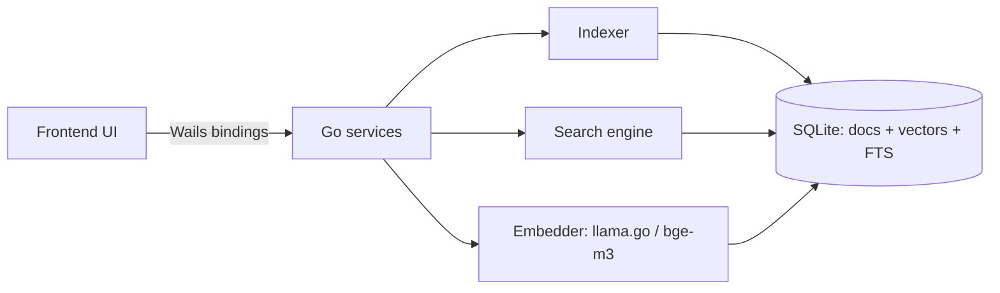

# How vectile works

A plain-English walkthrough of the whole app: what happens from launch, to indexing your files, to finding something in a search.

## The big picture

vectile is a desktop app with two halves.

- A Go backend reads your files, turns them into searchable chunks, stores them in a local SQLite database, and answers searches.
- A web-style UI (SolidJS) renders in a native window and talks to the backend over the Wails bridge.

Everything runs on your machine. No server, no cloud, no network calls.

## Startup

1. `main.go` runs first. It creates the data directory (under `os.UserConfigDir()/vectile`), loads `config.json` (or defaults), and builds the shared core: the embedder, the config, and the Wails app.
2. The app opens the database and creates the schema if it is missing.
3. The frontend loads. On mount it asks the backend for status, collections, and settings.

Nothing is indexed at startup. The model is not loaded yet either. Both happen lazily: the model loads on the first embed, indexing starts when you tell it to. On a fresh install (an empty library), a three-step tour walks Settings → Index → Search: add a folder, index it, search.

## Where your files go

The app keeps three things in the data directory.

- `config.json`, the settings you change in the UI.
- `db/vectile.db`, the SQLite database holding everything indexed.
- `models/bge-m3-Q4_K_M.gguf`, the embedding model. You place this file there yourself. The app never downloads it.

## Adding sources (Settings)

In Settings you add where your knowledge lives.

- Obsidian vaults: a folder of markdown notes.
- Project folders: any folder of documents.
- Code repositories: folders containing git repos. The app finds nested repos automatically.
- Calibre libraries: folders that hold a Calibre library.

Each saved change writes `config.json`. You also set chunk size, search weights, auto-reindex, and start-on-login here.

## Indexing (Index view)

Indexing turns files into searchable chunks.

1. You press "Index new" on a collection to pick up changed files, or "Re-index all" to re-embed everything, or Index all / Re-index all in the header for every collection at once.
2. A background goroutine walks the source. For each file it checks whether the file changed since the last run. Unchanged files are skipped. That is the incremental part.
3. Each file is parsed into text, then cut into chunks of about 500 words with a small overlap.
4. Each chunk is embedded. The bge-m3 model turns the text into a list of 1024 numbers that capture its meaning.
5. The chunk text, its metadata, and its vector are stored in SQLite. Vectors go into a vec0 table for fast similarity search. The text also goes into an FTS5 table for exact-word search.
6. Progress events stream to the UI, which shows a progress bar and the current file. A completion event updates the counts and shows a toast.

Code repos behave a little differently. Files are parsed with tree-sitter, so each function or class is its own chunk instead of a 500-word slice. Git watermarks track which commit was indexed, so the next run only reads files changed since then. Commit history is indexed as its own source type, so you can search "when did we add this function" by diff content.

## Pruning

When you delete or move a file, the database still has its chunks. Pruning fixes that. It walks the indexed sources for a collection and removes any whose file no longer exists on disk. Orphaned vectors (embeddings whose document is gone) are cleaned up too. Prune runs automatically before an "Index all", and you can trigger it per collection.

## Searching

Type a query in the search box. The backend runs two searches at once.

- Full-text search. The exact words from your query, matched against the FTS5 index. Fast, precise, literal.
- Vector search. The query is embedded into a 1024-number vector, then the database finds stored vectors that point in a similar direction. This catches meaning, so "how do we roll out changes safely" can match a note about blue-green deploys that never uses those words.

The vector path is two-stage. A cheap binary-quantized index finds a pool of candidates, then the exact float vectors are fetched and reranked by distance. That keeps searches fast on big libraries.

Both result lists are merged with Reciprocal Rank Fusion, which blends ranks rather than scores. The frontend shows them as cards with title, snippet, rank, collection, and path; a small toggle switches each result to the blended score. Expanding a card shows the whole passage plus "Open file" and "Reveal in folder" actions.

Filters narrow the search: collection, file type, path substring, sender or author (from metadata), and date range. The results count comes from your top-k setting.

## Browsing and the library

Library lists every collection with its source and chunk counts. Expanding one lists its files, a page at a time. Browse shows the chunks of one library grouped under their file, with a preview pane, and pages them in as you scroll: the chunk list carries no text, each page is a hundred rows, and only six pages are held at once, so the selected chunk's text is fetched on its own. Both read the same database the search uses, so nothing is out of sync.

## Background jobs

Auto-reindex, if enabled, runs Index all on a timer. A loop checks the config once a minute and fires when the interval has elapsed. Start-on-login registers the app to launch with your session. The status strip shows when the library was last indexed (the most recent source update). When auto-reindex is off and that date is more than a day old, Search shows a quiet "Last indexed N days ago · Re-index" hint.

## The model engine

The status pill shows the model as idle, loaded, or failed. It starts idle because the model is not loaded until the first embed. The first search or index loads it, which takes a couple of seconds for bge-m3. After that it stays resident. If the model file is missing or corrupt, the pill shows failed and vector search falls back to full-text search, so you still get exact-match results.

## Files worth reading first

- `main.go` for how everything is wired.
- `backend/indexer` for how indexing flows.
- `backend/search` for how a query is answered.
- `frontend/src/lib/store.tsx` and `frontend/src/lib/api.ts` for how the UI talks to the backend.
