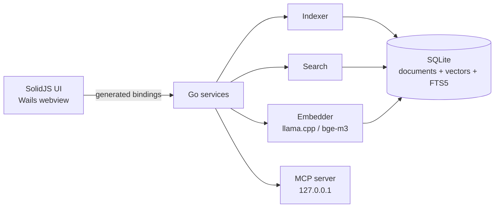

# How it is built

Two halves, one process, no server. A Go program reads files, splits them, turns them into numbers,
stores them, and answers searches. A SolidJS interface draws the window and asks the Go side for
everything it shows.

## The Go side

| Package | What it is responsible for |
|---|---|
| `appdata` | Finds the app data folder and the paths inside it. |
| `config` | The settings file, its defaults, and its allowed ranges. |
| `parser` | One reader per format: Markdown, PDF, DOCX, HTML, EPUB, plain text, code, Calibre metadata, Office files, notebooks. |
| `chunker` | Splits text into chunks, respecting headings. |
| `embeddings` | The llama.cpp embedder and the `.gguf` metadata reader. |
| `db` | Schema, queries, vector tables, word search, and the query cache. |
| `indexer` | Walks each source, batches the work, tracks what it has seen, and prunes. |
| `search` | Two-stage meaning search, word search, and rank fusion. |
| `services` | The API the interface calls: app, search, index, and model services. |
| `mcp` | The local Model Context Protocol server. |
| `startup` | Registering vectile to start with your session, per platform. |

## Storage

One SQLite file, which is a database that lives in a single file on disk. It holds the documents
with a full-text index over them, a vector table sized to the model, and the query cache.

Writes are serialized while reads stay concurrent, so a long index run does not stop you searching.

## How a search is answered

1. The query is looked up in the cache. A hit skips the model.
2. On a miss, the model produces the numbers for the query.
3. A quick pass over the compressed copy picks a shortlist of passages, then the full numbers for
   that shortlist are compared and reordered.
4. The word search runs against the full-text index at the same time.
5. Rank fusion merges the two ordered lists into one, weighted and scaled to a 0 to 1 score.

## How a file becomes chunks

Prose is split by headings, with fenced code blocks hidden first so a heading inside a code sample
does not start a section. Code is split by a parser that understands the language, so each function,
method, and class becomes its own chunk. Splitting code by syntax rather than line count is what
makes a code result readable on its own.

Files are fingerprinted by their contents, and a file whose fingerprint matches the stored one is
skipped. That is why a second index of a large vault is fast.

## The interface

SolidJS with TypeScript and Vite, styled with Tailwind CSS v4. Fonts ship with the app, so it never
reaches for a CDN.

The interface calls the Go side through bindings generated into
`frontend/bindings/vectile/backend/services`, and follows progress through events: `indexing:file`,
`indexing:progress`, `indexing:complete`, `indexing:all-done`, `indexing:cancelled`, `model:changed`,
`model:download-progress`, and `mcp:status`. An index run belongs to the Go side rather than the
window, which is why closing or reloading mid-run does not lose the progress bar.

## The desktop shell

Closing the window hides vectile in the system tray instead of quitting, and the tray menu carries
the live status, per-collection index actions, and cancel. A single-instance guard means a second
launch raises the window you already have rather than starting a copy that would fight over the
database.

## The model engine

llama.cpp is vendored as a Go binding, with prebuilt static libraries committed for Windows, Linux,
and macOS. There is no model server, no HTTP call to an embedding endpoint, and no Ollama
dependency. The model file is read from disk on first use and lives in the app's own memory.

## Tests and releases

The Go test suite covers the parsers, the chunker, the database, search, the indexer, the MCP server,
and the services. Tests that need real embeddings skip themselves when no model is present, so a
fresh clone can run the suite without downloading 400 MB. Releases are built by GitHub Actions from
a version tag, producing the files listed on [Download](/docs/download).
